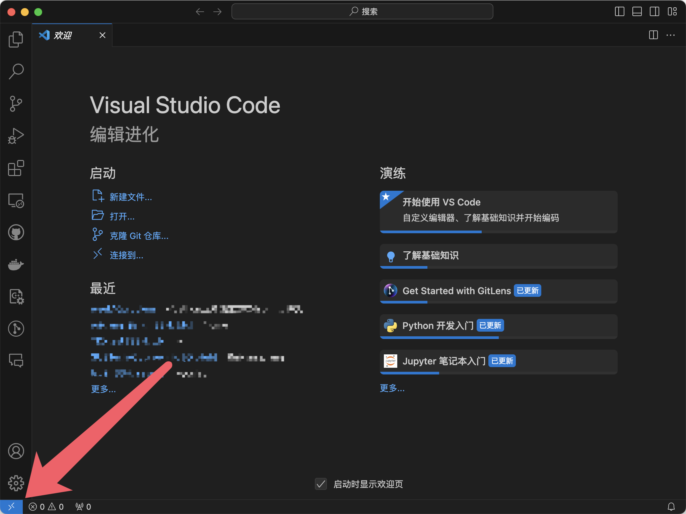

# SUSTech Course Info

## 介绍

😊大家好，欢迎来到这个仓库~

我叫 Yuhe NIE，是一名19级（2023年毕业）的计算机科学与技术专业的本科生，我的 GPA 为 3.81/4.0（进专业后 GPA 在 3.9 以上），其中计算机系的绝大部分课程考试成绩均为 A- 及以上。相信这个仓库的大部分内容可以帮到正在进入计算机系学习的你~希望大家都能取得好成绩！

SUSTech Course Info 主要记录了从大一到大四期间大部分必修课（以及部分选修课）的内容。包括笔记、作业、考试卷（包括其它学校）Project、Presentation 等内容。

如果想要进一步讨论本仓库，请联系：nieyh2019@mail.sustech.edu.cn

## 如何浏览本仓库

### 文件划分

大体上，不同的课程会依据当期的课程设定被划分为如下的内容：

- **Note**：课程笔记，大部分为中文笔记，部分课程（操作系统、计算机图形学）为英文笔记
- **Lab**：实验课报告，不同年份的实验课内容可能有变化
- **Assignment**：通常是理论作业/课程阶段性作业
- **Project**：课程项目，不同年份的课程项目可能有变化
- **Midterm/Final/Exam**：期中期末考试的试卷，可能是我们学校或者也可能是其他学校的

### 下载文件

如果你想下载具体的内容，又觉得本仓库过于庞大，请使用这个在线 [gadget](https://minhaskamal.github.io/DownGit/#/home) 下载需要的子文件夹或者文件（感谢 **[NeumoNeumo](https://github.com/NeumoNeumo)** 提供的方法）

当然你也可以通过vscode直接打开本仓库而无需下载，步骤如下图：

（提供者：Ruixiang Jiang）

## 如何利用本仓库的文件学习

### Note

请注意，每个课程大多有一个 `Note` 文件夹，这里面包含着我的课程笔记。我的笔记内容多来自于课程的 Lecture PPT 或者参考书，我自己做了中文翻译和整理归纳。范围涵盖了所有 PPT 的大部分知识点。

笔记内容其实大部分为已有 Lecture 的中文翻译版。请将关注重点放在每一份笔记的**目录**上。在大部分课程中，Lecture PPT 结构散乱且缺乏系统梳理，本仓库的笔记部分详细整理了一个可供分类的框架，按照不同的层级结构划分 PPT 上的知识点。这是在你系统学习课程中需要详细建立的课程结构。了解目录结构有助于你学习课程的时候对每个概念的所在的层级关系有了解。

### Exam/Midterm/Final

在期中/期末考试前一周，可以查看这些部分的内容。这些文件夹中包含了我在考试前做过的一些试卷（本校或者其它学校的）。当你对课程所讲内容的结构有所了解后，应该可以准确判断出这些试卷中哪个部分是你需要的，哪个部分是我们的课程没讲过的。从而有针对性的练习部分题目。

关于这个部分，我推荐大家在复习的时候自己网上搜索考试试卷。比如你即将要迎来数据结构和算法分析的考试，那么你可以在 Google 上搜索 `Data Structure and Algorithm Analysis [Final/Midterm] with [answer/solution] pdf`，你可以下载一大堆试卷（通常可以超过 30 份），然后自行在其中筛选需要的题目。结合 Lecture 将的内容进行有针对性的刷题。

### Lab/Assignment/Project

由于这个部分具有时效性。不同学期选课的同学的内容可能不同。并且由于这些报告的内容由个人完成，**并不能 100% 保证内容的正确性**。依据我在 Sakai 上的分数而言，这部分的准确率在 95% 左右。所以**报告内容仅供参考**。

在学习/复习的时候可以简要浏览 Lab/Assignment 的内容，可以将与 Lecture 相关的题目、知识点记录下来复习。而对于具体实操性（特别是涉及写代码的部分），请以你当前 Lab 的课件和老师讲述的内容为主，老师会在每节 Lab 课上有更具体详细的讲解。

关于一些大作业的报告，可以参考报告的框架、格式和大概体量，我的报告平均分数多在 95-100 分，你可以对大致的达到这个分数需要的内容有所了解。

## 如何保证大部分课程在 A- 以上

我个人绝大部分计系课程（除了计算机导论 B，数据结构与算法分析 B+），按照如下学习流程取得了 A- 及以上的分数：

1. 每周课程结束之后及时整理自己的笔记/参考我的笔记，**最好可以自己记录**。注重梳理各个 Lecture 中知识点的**层级结构**。如果遇到老师讲课不清楚的知识点，可以阅读**英文原版参考书**。通常课程开头列出的参考书是 Lecture 的详细版。英文原版书籍内容非常详细且逻辑清晰易懂，可以帮助你弄懂那些课上没听懂的地方（也可能是老师讲的很烂）
   - 推荐使用 [Typora](https://typora.io/) 记录笔记、完成作业等（一款轻型的基于 Markdown 语法的编辑器）记录笔记，它是一款轻型美丽且非常方便的编辑器，支持包括代码高亮、LaTeX 数学公式等重要内容。如果你打字熟练并熟悉它的部分快捷键，记录效率将远高于手写笔记和其它编辑器（OneNote，Word 等）。
   - 推荐使用 Z-Library（需翻墙）或者南科大的数字数据库获取需要的电子书资源 favor Reference Book than Lecture for any problem encountered during your study
2. 记录每周的 Lab/Assignment，可以像我一样用 Typora 写作业并且导出 pdf 保存。通常 Lab 中的实践/代码部分在考试中是不会出现的，如果 Lab/Assignment 存在 Lecture 相关的题目（特别是大题），可以在复习的时候重点关注。期中期末很可能出同类型的题目。如果有不清楚怎么写的题多去问同学（但是不要抄袭）
3. 涉及到写小论文的 Assignment/Project，可以提早**学习 LaTeX 的使用方法**（三天入门即可）。老师和学助们更喜欢 LaTeX 报告。并且当你学会后，LaTeX 的便捷度远大于 Word
4. **尽早开始你的 Project**。工程性 Project 可以在 bilibili 上找到丰富的工程课程资料（例如尚硅谷、尚学堂），从零上手学习开发。需要注意的是有些同学非常喜欢卷 Project，这其实**耗费了非常多的时间且收效甚微**。正常情况下你只需要一部分时间就可以达到 Project 80 分的基准线，再努力多做几个功能就可以在 90-95，而你需要完成大量的功能才能达到 100。（所以我通常只在我喜欢的课程上用心完成，比如 Java 和 OOAD，而在计网计组数字逻辑上只是有个 80-90 分就行了）。请注意它们的最终占比通常只有 20%-30%，你最后耗费的大量时间去卷最后的 5 分（x0.3）是**非常不值得**的！大量的时间可以被节省出来用于复习期中期末或者好好完成作业。
5. 提前一周开始复习。请不要把大量时间浪费在 Project 上。在期中期末考试的时候最重要的是结合笔记复习知识点。做到心中有**知识点的层级架构**（可以参考我的笔记）。理解每一个部分具体有哪些内容。并且自行在网上搜索一些试卷在最后一段时间内刷刷题，这对考试的帮助很大。主要搜索**国外的试卷**，我们的考试与国内的考试有很大不同。我有很多自己找到的试卷压中了相当一部分的题目（比如深度学习、OOAD、算法分析等）。刷个 5-10 套（自行判断哪些是可能被考到的）对你的考试有很大的帮助。通常好好复习后期中期末考试可以保证在 80-90 分左右

最终拿到 A- 的大致占比如下

- 签到（10%）：拿满
- Lab/Assignment（30%）：尽可能拿满，用心完成并且及时跟同学对答案总评一般不会扣分超过 2 分
- Project（20%）：Project 分数尽量保证在 85-95 之间，有能力的同学可以冲击满分，一般扣分不会超过 3 分
- Midterm/Final （40%）：期中期末考试超过 80 分，有能力冲击 90 分，通常老师会改的很松并且还可能调分，所以有 80 分基本保证你的总评只会扣 3-5 分左右

## 如何贡献本仓库

如果你想要为这个仓库添加新的课程/补充自己的笔记材料等，请发起一个 pull request 并且表示你希望更新的内容。

- 通常会接收如下材料：笔记/Cheating Paper/作业报告/Lab 实验报告/Project 报告/期中期末考试试卷（注意材料内容多为你个人书写或是祖传试卷内容）
- 通常不会接收如下材料：Lecture，Lab 课件

## 写在最后

南科大计算机系课程参差不齐，有的很好有的一般。整体上你需要大量时间自己主动学习并且查询资料才能维持你的分数。但是请相信我，选择计算机专业是一个非常明智的选择，当你从大一的高数大物中出来，又坚持过了DSAA、数字逻辑、计组、离散数学等大二较难的课程后，并且不断坚持记录、整理和总结的习惯的话，到大三你会感到拨云见日。此后计算机系的任何课程，不论是在国内还是在海外，不论是线上还是线下，你都能有一套自己的处理方式。这时候你一定会明白如何学好CS了！

最后为本科成绩做个简单的总结~
| 课程名称              | 分数 | 评价 |
| --------------------- | ---- | ---- |
| 计算机导论            | 86   | B    |
| 计算机程序设计基础A   | 96   | A    |
| 数据结构与算法分析    | 89   | B+   |
| 数字逻辑              | 93   | A    |
| 数据库原理            | 94   | A    |
| 算法设计与分析        | 96   | A    |
| 计算机组成原理        | 94   | A    |
| 数据挖掘              | 99   | A+   |
| 认知科学导论          | 95   | A    |
| 计算机系统设计及应用A | 97   | A+   |
| 面向对象设计与分析    | 94   | A    |
| 人工智能              | 91   | A-   |
| 软件工程              | 98   | A+   |
| 计算机网络            | 92   | A-   |
| 深度学习              | 94   | A    |
| 操作系统              | 98   | A+   |
| NTU-计算机图形学      | \    | A    |

